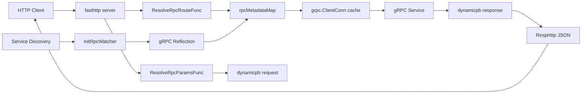
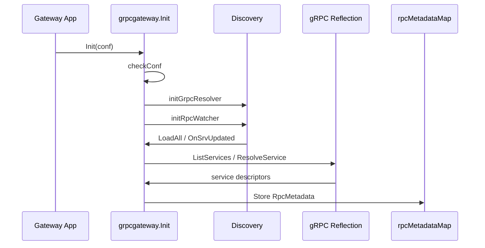

# grpcgateway

`grpcgateway` 是一个用于将 HTTP 请求动态代理到 gRPC 服务的网关框架。它不依赖预先生成的 HTTP handler，而是通过服务发现获取 gRPC 节点，通过 gRPC reflection 动态解析服务、方法和 protobuf 描述，再用 `dynamicpb` 构造请求、调用 gRPC，并将响应转换为 HTTP JSON。

项目适合用作内部 HTTP 到 gRPC 的统一入口，尤其适合 gRPC 服务频繁增删、protobuf 结构持续变化、不希望每次都重新生成网关代码或重启网关的场景。

## 核心特性

| 特性 | 说明 |
| --- | --- |
| 动态代理 | HTTP 请求按路径解析到 `package.service.method`，运行时调用对应 gRPC 方法。 |
| 服务自动发现 | 通过 `microgosuit` discovery 或自定义 discovery watcher 自动发现新增、更新、删除的 gRPC 服务。 |
| protobuf 热更新 | 基于 gRPC reflection 拉取服务描述，服务 proto 更新后可重新解析元数据。 |
| 无需生成网关代码 | 使用 `dynamicpb.Message` 和反射描述动态构造请求/响应。 |
| 连接复用 | 按 gRPC target 缓存 `grpc.ClientConn`，减少连接创建开销。 |
| 元数据缓存 | 按 RPC key 缓存服务、方法、输入输出类型和对象池。 |
| 多种 HTTP 参数格式 | 支持 JSON body、URL query、`x-www-form-urlencoded`、`multipart/form-data`。 |
| 文件字段支持 | multipart 文件会转为 base64，填充到 protobuf `bytes` 字段。 |
| Header 透传 | HTTP request header 转为 gRPC metadata，gRPC response metadata 写回 HTTP header。 |
| 可插拔 | 支持自定义路由解析、参数解析、响应包装、鉴权、过滤和日志。 |
| 流式 RPC 底层支持 | 提供 `InvokeGrpcSupportStream` / `InvokeGrpcSupportStreamV2` 调用流式 RPC；默认 HTTP handler 仅走 unary。 |

## 总体架构



网关启动后会先初始化 gRPC resolver，然后扫描或监听服务发现中的 gRPC 节点。每发现一个节点，就连接该节点的 reflection 服务，列出服务和方法，构建 `RpcMetadata` 缓存。HTTP 请求进来后，网关根据路径找到缓存的 RPC 元数据，动态构造请求并调用目标 gRPC 服务。

## 核心模块

| 文件 | 说明 |
| --- | --- |
| `gateway.go` | 初始化、服务发现监听、reflection 解析、gRPC 连接缓存、动态调用和 metadata 缓存。 |
| `transport.go` | HTTP server、默认路由解析、参数解析、响应封装和 header 透传。 |
| `decode.go` | JSON / URL values 到 `dynamicpb.Message` 的解码逻辑。 |
| `log.go` | 可替换 logger 接口和默认 stdout logger。 |
| `error.go` | 网关通用错误定义。 |
| `example/` | echo 服务、HTTP 代理示例、自定义 proto 方法扩展。 |
| `test/` | URL 参数解码和路径解析测试。 |

## 初始化配置

主配置结构：

```go
type Conf struct {
    ServiceName string
    GrpcConf
}
```

`GrpcConf`：

| 字段 | 说明 |
| --- | --- |
| `MicroGoSuitMetadataConfFilePath` | microgosuit 元数据配置文件路径。使用默认 microgosuit discovery 时必填。 |
| `MicroGoSuitDiscoverPrefix` | 服务发现 key 前缀。 |
| `GrpcResolveSchema` | gRPC resolver schema，例如 `testschema`。 |
| `GrpcClientOptions` | 自定义 `grpc.DialOption` 列表。为空时默认使用 insecure credentials。 |
| `CallClientTimeoutMs` | gRPC 调用超时时间，单位毫秒；0 表示不设置超时。 |
| `InitGrpcResolverFunc` | 自定义 resolver 初始化函数。 |
| `InitAndWatchGrpcClientMetadataFunc` | 自定义服务发现和 metadata 监听函数。 |

配置校验要求：

| 条件 | 说明 |
| --- | --- |
| `ServiceName` 必填 | 用于标识网关服务。 |
| `GrpcResolveSchema` 必填 | 用于构造 gRPC target。 |
| resolver 初始化来源必填 | 必须设置 `InitGrpcResolverFunc`，或提供 `MicroGoSuitMetadataConfFilePath` 使用默认 microgosuit 初始化。 |
| metadata watcher 来源必填 | 必须设置 `InitAndWatchGrpcClientMetadataFunc`，或提供 `MicroGoSuitMetadataConfFilePath` 使用默认 microgosuit discovery。 |

示例：

```go
err := grpcgateway.Init(&grpcgateway.Conf{
    ServiceName: "httpproxy",
    GrpcConf: grpcgateway.GrpcConf{
        MicroGoSuitConf: grpcgateway.MicroGoSuitConf{
            MicroGoSuitDiscoverPrefix:       "test_discovery",
            MicroGoSuitMetadataConfFilePath: "../meta.json",
        },
        GrpcResolveSchema: "testschema",
        CallClientTimeoutMs: 3000,
    },
})
if err != nil {
    panic(err)
}
```

`example/meta.json`：

```json
{
  "env": "dev",
  "discovery": "etcd",
  "etcd": {
    "connect_timeout_ms": 10000,
    "endpoints": ["http://localhost:2379"]
  }
}
```

## 启动 HTTP 网关

默认启动方式：

```go
err := grpcgateway.HandleHttpDefault("127.0.0.1", 8001)
if err != nil {
    panic(err)
}
```

完整可插拔版本：

```go
err := grpcgateway.HandleHttp(
    "127.0.0.1",
    8001,
    grpcgateway.ResolveRpcRouteFromHttp,
    grpcgateway.ResolveRpcParamsFromHttp,
    grpcgateway.RespHttp,
)
```

`HandleHttp` 的三个扩展点：

| 扩展点 | 类型 | 说明 |
| --- | --- | --- |
| `ResolveRpcRouteFunc` | `func(ctx) (packageName, svcName, methodName, error)` | 从 HTTP 请求中解析目标 RPC。 |
| `ResolveRpcParamsFunc` | `func(ctx, method) (params, header, callOpts, error)` | 解析请求参数、metadata 和 gRPC call options。 |
| `response` | `func(*ResponseHttp)` | 将 gRPC 结果或错误写回 HTTP。 |

这三个扩展点可以用来实现鉴权、灰度、限流、自定义路由、自定义响应格式、方法注解校验等逻辑。

## HTTP 路由规则

默认路由解析函数是 `ResolveRpcRouteFromHttp`。

支持两种路径格式：

| HTTP path | 解析结果 |
| --- | --- |
| `/<Service>/<Method>` | `packageName = lowerFirst(Service)`，`svcName = Service`，`methodName = Method` |
| `/<Package>/<Service>/<Method>` | `packageName = lowerFirst(Package)`，`svcName = Service`，`methodName = Method` |

示例：

| 请求路径 | 目标 RPC key |
| --- | --- |
| `/Echo/BasicEcho` | `echo.Echo.BasicEcho` |
| `/echo/Echo/BasicEcho` | `echo.Echo.BasicEcho` |

内部 metadata key 格式为：

```text
<package>.<service>.<method>
```

其中 reflection 返回的完整服务名通常是：

```text
<package>.<service>
```

## 服务发现与 protobuf 反射

初始化流程：



`resolve(host, port)` 会：

1. 建立到 gRPC 节点的连接。
2. 创建 reflection client。
3. 调用 `ListServices()` 获取服务列表。
4. 对每个服务调用 `ResolveService()` 获取 descriptor。
5. 遍历 method，构建 `RpcMetadata`。
6. 为每个 method 创建 request/response `dynamicpb.Message` 对象池。
7. 将 metadata 存入 `rpcMetadataMap`。

当 discovery 事件为删除服务时，会从 `rpcMetadataMap` 中删除该服务对应的 metadata。

## RpcMetadata

`RpcMetadata` 是一次动态调用需要的核心描述：

| 字段 | 说明 |
| --- | --- |
| `svcName` | service 简名，例如 `Echo`。 |
| `svcFullyQualifiedName` | service 完整名，例如 `echo.Echo`。 |
| `method` | `*desc.MethodDescriptor`，包含输入、输出、stream 类型等信息。 |
| `invokeMethodName` | gRPC 调用路径，例如 `/echo.Echo/BasicEcho`。 |
| `reqPool` | request `dynamicpb.Message` 对象池。 |
| `respPool` | response `dynamicpb.Message` 对象池。 |

可用 API：

| API | 说明 |
| --- | --- |
| `WalkRpcMetadata` | 遍历当前已缓存的全部 RPC metadata。 |
| `GetRpcMetadata` | 按 package、service、method 获取 metadata。 |
| `DeleteRpcMetadata` | 删除指定 metadata。 |

## gRPC 连接缓存

网关按 target 缓存 `grpc.ClientConn`：

```text
<GrpcResolveSchema>:///<package>.<service>
```

例如：

```text
testschema:///echo.Echo
```

`makeRpcConn` 使用双重检查锁创建连接，连接创建后会复用。`HandleHttp` 退出时会调用 `ClearGrpcConns()` 关闭所有连接。

默认 gRPC client option：

```go
grpc.WithTransportCredentials(insecure.NewCredentials())
```

如果配置了 `GrpcClientOptions`，则完全使用用户提供的 options。

## 参数解析

默认参数解析函数是 `ResolveRpcParamsFromHttp`，它会：

1. 遍历 HTTP request header，转为 gRPC metadata。
2. 跳过 `connection` header。
3. 调用 `HttpPramsToJsonOrUrlValues` 解析参数。
4. 返回 `params`、`header`、`callOpts`。

### JSON body

对于 `POST`、`PUT`、`PATCH`：

| Content-Type | 行为 |
| --- | --- |
| `application/json` | 直接将 body 作为 JSON 传给 `protojson.UnmarshalOptions`。 |
| 其他 | 转为 `url.Values`，按表单逻辑解析。 |

JSON 解码参数：

```go
protojson.UnmarshalOptions{
    AllowPartial: true,
    DiscardUnknown: true,
}
```

这意味着未知字段会被忽略，部分字段缺失也允许。

### URL query / form

以下来源都会合并为 `url.Values`：

| 来源 | 说明 |
| --- | --- |
| URL query | GET/DELETE 以及所有请求 URL 上的 query。 |
| `application/x-www-form-urlencoded` | 通过 `ctx.PostArgs()` 读取。 |
| `multipart/form-data` 文本字段 | 读取 form value。 |
| `multipart/form-data` 文件字段 | 读取文件内容并 base64 编码。 |

### URL 参数路径语法

`DecodePbFromURLValues` 支持基础类型、enum、bytes、repeated、map、嵌套 message、repeated message。

示例：

```text
string_val=hello
int32_val=123
bool_val=true
repeated_str=first&repeated_str=second
repeated_str[2]=third
map_val.key1=value1
nested_msg.nested_int=42
repeated_nested_msg[0].nested_int=66
file_content=<base64>
```

类型规则：

| Protobuf 类型 | 参数解析 |
| --- | --- |
| `string` | 原始字符串。 |
| `bytes` | base64 解码。 |
| `int32/int64/sint*/sfixed*` | 十进制整数解析。 |
| `uint32/uint64/fixed*` | 十进制无符号整数解析。 |
| `bool` | `strconv.ParseBool`。 |
| `float/double` | `strconv.ParseFloat`。 |
| `enum` | 优先按 enum name，失败后按数字解析。 |
| `repeated scalar` | 无索引时 append，有 `[index]` 时补零并 set。 |
| `repeated message` | 必须通过 `[index]` 指定对象。 |
| `map` | 通过 `map_field.key=value` 设置。 |

注意：同一个 repeated 字段不建议同时混用 append 写法和 index 写法，否则因为 `url.Values` 遍历顺序不稳定，可能得到非预期顺序。

## HTTP 响应格式

默认响应函数 `RespHttp` 输出 JSON：

```json
{
  "err_code": 0,
  "err_msg": "",
  "data": {}
}
```

字段说明：

| 字段 | 说明 |
| --- | --- |
| `err_code` | gRPC status code；非 gRPC 错误时为 `-1`。 |
| `err_msg` | 错误消息。 |
| `data` | gRPC response 经 `protojson.MarshalOptions{UseProtoNames: true}` 转换后的 map。 |

如果 gRPC 返回 metadata，默认响应会将 metadata 写入 HTTP response header。

## gRPC 调用 API

### InvokeGrpc

```go
resp, respHeader, err := grpcgateway.InvokeGrpc(
    "echo",
    "Echo",
    "BasicEcho",
    params,
    header,
    callOpts,
)
```

特点：

| 项 | 说明 |
| --- | --- |
| 支持类型 | 仅支持 unary RPC。 |
| 请求构造 | 使用 metadata 中的 input descriptor 创建 `dynamicpb.Message`。 |
| 响应对象 | 从 response pool 取 `dynamicpb.Message`。 |
| header | 自动添加 `grpc.Header(&respHeader)`。 |
| stream | 如果目标方法是 stream，返回 `ErrNotSupportHttpAccess`。 |

默认 HTTP 网关使用的是 `InvokeGrpc`，因此默认 HTTP 入口只支持 unary RPC。

### InvokeGrpcSupportStream

基于 `grpcdynamic.NewStub`，支持：

| RPC 类型 | 支持情况 |
| --- | --- |
| unary | 支持 |
| server streaming | 支持 |
| client streaming | 支持 |
| bidi streaming | 支持 |

它的返回值包含：

| 返回值 | 说明 |
| --- | --- |
| `metadata.MD` | response header。 |
| `proto.Message` | unary response。 |
| `chan proto.Message` | stream response channel。 |
| `chan error` | stream error channel。 |
| `error` | 调用初始化错误。 |

### InvokeGrpcSupportStreamV2

基于原生 `grpc.ClientConn.NewStream` 实现，返回 `*dynamicpb.Message` 或 `chan *dynamicpb.Message`。如果业务希望在 HTTP 层暴露 stream，需要自己封装流式响应协议，例如 SSE、WebSocket、chunked JSON 或自定义长连接。

## 示例：基于方法注解做鉴权

示例 proto 定义了自定义 method option：

```proto
extend google.protobuf.MethodOptions {
    HttpProxyAccessRule http_proxy_access_rule = 50001;
}

message HttpProxyAccessRule {
    string method = 1;
    bool NoAuth = 2;
}
```

业务 proto：

```proto
service Echo {
  rpc BasicEcho(EchoReq) returns (EchoResp) {
    option (ext.http_proxy_access_rule) = {
      method: "POST"
    };
  }

  rpc NoAuthEcho(EchoReq) returns (EchoResp) {
    option (ext.http_proxy_access_rule) = {
      method: "GET"
      NoAuth: true
    };
  }
}
```

HTTP 代理示例在 `example/http2grpc/proxy.go`：

```go
err = grpcgateway.HandleHttp(
    "127.0.0.1",
    8001,
    grpcgateway.ResolveRpcRouteFromHttp,
    func(ctx *fasthttp.RequestCtx, method *desc.MethodDescriptor) (interface{}, map[string][]string, []grpc.CallOption, error) {
        if !proto.HasExtension(method.GetMethodOptions(), ext.E_HttpProxyAccessRule) {
            return nil, nil, nil, grpcgateway.ErrNotSupportHttpAccess
        }

        opt := proto.GetExtension(method.GetMethodOptions(), ext.E_HttpProxyAccessRule)
        httpOpt, ok := opt.(*ext.HttpProxyAccessRule)
        if !ok {
            return nil, nil, nil, grpcgateway.ErrNotSupportHttpAccess
        }

        if httpOpt.Method != string(ctx.Method()) {
            return nil, nil, nil, grpcgateway.ErrNotSupportMethod
        }

        if !httpOpt.NoAuth {
            if token := ctx.Request.Header.Peek("token"); token == nil || string(token) != "123456" {
                return nil, nil, nil, grpcgateway.ErrNoAuth
            }
        }

        return grpcgateway.ResolveRpcParamsFromHttp(ctx, method)
    },
    grpcgateway.RespHttp,
)
```

这个模式说明：`grpcgateway` 本身只负责动态代理基础设施，具体哪些 RPC 可以暴露、允许哪些 HTTP method、是否鉴权、如何转换响应，都可以通过扩展点实现。

## 与 easymicro 集成

`https://github.com/995933447/easymicro/grpcgateway/gateway.go` 是对本项目的适配层，它提供：

| 函数 | 说明 |
| --- | --- |
| `InitGRPCResolverFunc(ctx, resolveSchema, discoveryName)` | 返回可注入到 `Conf.InitGrpcResolverFunc` 的 resolver 初始化函数。 |
| `InitAndWatchGRPCClientMetadataFunc(discoveryName)` | 返回可注入到 `Conf.InitAndWatchGrpcClientMetadataFunc` 的 metadata watcher。 |

适配层会使用 easymicro/discovery 加载服务节点，并定时每 10 分钟主动刷新一次 metadata 作为兜底。

## 代码生成与示例运行

示例 proto 生成脚本：

```bash
cd example
./gen_ext.sh
./gen_echo.sh
```

测试 proto 生成脚本：

```bash
cd test
./gen_test_decode.sh
```

示例服务：

| 路径 | 说明 |
| --- | --- |
| `example/echoserver/echo_server.go` | 启动 Echo gRPC 服务并注册到 discovery。 |
| `example/http2grpc/proxy.go` | 启动 HTTP 到 gRPC 代理，并基于 method option 做鉴权和 method 校验。 |

典型运行顺序：

1. 启动 etcd 或配置中指定的 discovery 后端。
2. 启动 `example/echoserver`。
3. 启动 `example/http2grpc`。
4. 通过 HTTP 请求访问 `/echo/Echo/BasicEcho` 或 `/Echo/NoAuthEcho`。

## 可以使用的预错误定义

| 错误 | 说明 |
| --- | --- |
| `ErrServiceNotFound` | 路由无法解析或 metadata 中找不到目标 RPC。 |
| `ErrNotSupportHttpAccess` | 目标 RPC 不允许通过 HTTP 访问，或默认 HTTP 入口遇到 stream RPC。 |
| `ErrNotSupportMethod` | HTTP method 不符合业务定义。 |
| `ErrNoAuth` | 鉴权失败。 |

默认响应中，普通错误会输出：

```json
{
  "err_code": -1,
  "err_msg": "service not found",
  "data": null
}
```

gRPC status 错误会输出对应 status code 和 message。

## 生产使用建议

1. 所有被代理的 gRPC 服务应启用 reflection，否则网关无法动态解析 protobuf 描述。
2. 对外暴露 HTTP 时，建议通过自定义 `ResolveRpcParamsFunc` 强制校验 method option、鉴权和权限范围。
3. 对于 `GrpcClientOptions`，生产环境建议配置 TLS、keepalive、拦截器、负载均衡等选项。
4. 为 `CallClientTimeoutMs` 设置合理超时，避免 HTTP 请求无限等待。
5. 如果 proto 高频变化，应配合服务更新事件或定时刷新重新 `resolve` 节点。
6. URL 参数适合简单请求；复杂结构建议使用 JSON body。
7. multipart 文件会被完整读入内存并 base64 编码，上传大文件时需要谨慎。
8. 默认响应格式适合作为内部统一网关响应；对公网关可自定义 response 函数以隐藏内部错误。
9. stream RPC 如需 HTTP 暴露，需要额外设计 HTTP 流式协议，不建议直接使用默认 handler。

## 当前实现注意事项

| 事项 | 说明 |
| --- | --- |
| 默认 HTTP 仅支持 unary | `HandleHttp` 调用 `InvokeGrpc`，遇到 stream RPC 会返回 `ErrNotSupportHttpAccess`。 |
| Content-Type 判断较严格 | JSON body 仅在 content type 等于 `application/json` 时生效；带 charset 的值可能走表单解析。 |
| 请求对象池使用需谨慎 | `makeRpcReq` 从 pool 取 message；调用方如使用低层 API，应在适当时机 reset/put。 |
| response pool 默认由 HTTP handler 回收 | 自定义调用 `InvokeGrpc` 后需要参考默认 handler 回收响应对象。 |
| URL repeated 字段顺序 | 不建议同时使用 append 和 `[index]` 两种写法。 |
| metadata 删除按服务名匹配 | discovery 删除事件会删除对应服务的全部 method metadata。 |
| reflection 失败会跳过服务 | `ResolveService` 失败会重试一次，仍失败则跳过该服务。 |
| grpc 连接缓存不会随 metadata 删除自动关闭单个连接 | 当前提供 `ClearGrpcConns` 统一关闭。 |

## 适用场景

`grpcgateway` 适合：

| 场景 | 原因 |
| --- | --- |
| 内部 HTTP 调 gRPC 网关 | 无需为每个服务生成 HTTP handler。 |
| gRPC 服务频繁上下线 | 服务发现和 metadata watcher 可动态更新。 |
| protobuf 快速迭代 | reflection 可运行时解析最新服务描述。 |
| 统一鉴权和访问控制 | 可通过 method option + 自定义参数解析函数实现。 |
| 调试和临时开放接口 | 默认路径路由和动态请求构造能快速接入。 |

不太适合：

| 场景 | 原因 |
| --- | --- |
| 强规范 OpenAPI 网关 | 本项目不生成 OpenAPI，也不是基于 `google.api.http` 注解。 |
| 高度定制 REST 语义 | 默认路由是 RPC 风格，不是资源风格 REST。 |
| 大文件上传 | multipart 文件会读入内存并 base64 编码。 |
| 默认 HTTP 直接支持 stream | 需要业务另行封装 SSE/WebSocket/chunked 响应。 |
